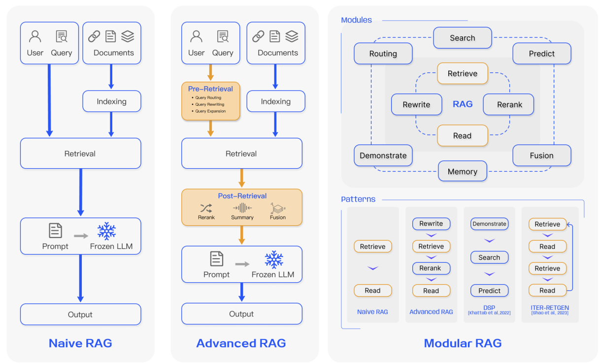
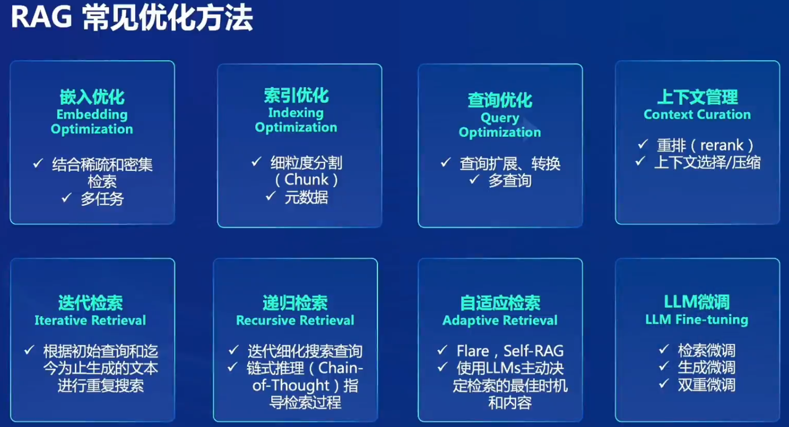
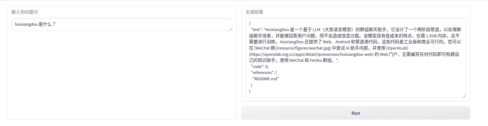
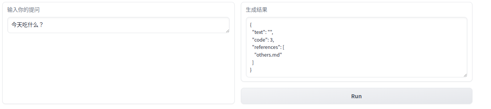
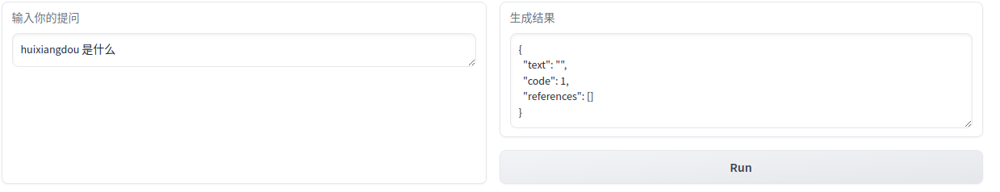
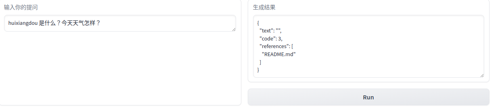
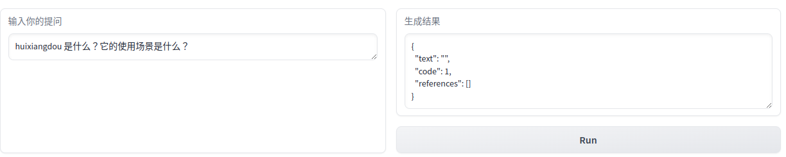
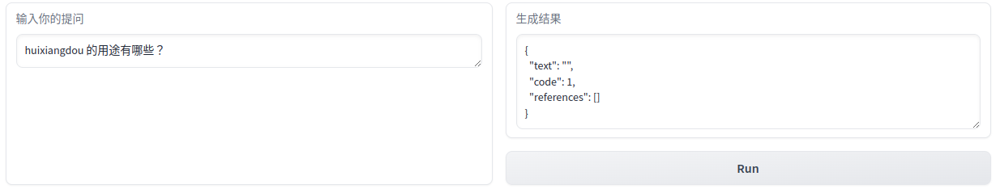

# homework for 3rd class(huixiangdou)

## 1. RAG知识点

RAG(Retrieval Augmented Generation), 关键词 检索 & 生成 & 外部数据库。

0. 初始状态，将知识源分隔成小块，编码为向量，存储到向量数据库(vector DB)中

1. 收到用户的问题，将其编码成向量
2. 在vector DB中检索与之相关的数据块(top-k chunks)
3. 将检索到的数据块与原始问题一起作为prompt 再传入给LLM，使其生成最终的回答。

> 有2次LLM交互


优点：

1. 幻觉问题& 知识的局限性

   解决LLM在处理知识密集性任务时可能出现的幻觉、知识过时、缺乏透明可追溯的推理过程等问题，提供更准确的回答、降低推理成本、实现外部记忆。

2. 无需训练大模型 我们即可使用新领域的知识。

3. 数据安全的需要

   私域数据不好上传进行训练


### 3个范式



#### naive RAG

三个最重要的部分：Indexing，Retrieval, Generation

* Indexing, 将知识源分隔为chunk，embedding后存入向量数据库
* Retrieval, 将用户的问题embedding，然后在vector DB中匹配相近的top-k chunk
* Generation, 将原始问题和Retrieval获得结果一起作为prompt再次输入给LLM，生成最终的答案。

局限性，如检索精度和召回率的问题、生成过程中可能出现的幻觉问题以及信息增强方面的挑战。

#### Advanced RAG

在naive RAG的基础上，对Retrieval进行增强：预检索（pre-retrieval）和后检索（post-retrieval）。

通过滑动窗口方法、细粒度分割和元数据的整合来改进索引技术。在后检索过程中，主要方法包括重新排名检索到的文本块和上下文压缩，以确保检索到的信息与查询最相关且不会过多地分散模型的注意力。Advanced RAG通过这些优化方法，提高了检索的准确性和生成内容的相关性。

#### Modular RAG

Modular RAG进一步超越了前两个范式，提供了更高的适应性和灵活性。它通过引入多个特定的功能模块和替换现有模块来增强其组件。例如，增加了搜索模块以适应特定的场景，通过LLM生成的代码和查询语言直接在各种数据源（如搜索引擎、数据库和知识图谱）上进行相似性搜索。Modular RAG支持顺序处理和端到端集成训练，并且可以通过模块替换或重构来解决特定挑战。此外，Modular RAG通过引入新的模块和调整现有模块之间的交互流程，增强了其在不同任务上的适用性。




## 2. 作业1 - 部署huixiangdou并对话

### 2.1 case-1 positive



日志：

```
2024-04-13 15:55:15.037 | INFO     | huixiangdou.service.llm_server_hybrid:generate_response:519 - ('“huixiangdou 是什么？”\n请仔细阅读以上内容，判断句子是否是个有主题的疑问句，结果用 0～10 表示。直接提供得分不要解释。\n判断标准：有主语谓语宾语并且是疑问句得 10 分；缺少主谓宾扣分；陈述句直接得 0 分；不是疑问句直接得 0 分。直接提供得分不要解释。', '根据您提供的内容，我无法判断"huixiangdou 是什么？" 这个句子的主题，因为它不包含任何有关于主题的信息。所以，我无法给出 0～10 的分数。请提供更具体的信息，以便我能够更准确地评估。')
2024-04-13 15:55:15.038 | DEBUG    | huixiangdou.service.llm_server_hybrid:generate_response:522 - Q:有主题的疑问句，结果用 0～10 表示。直接提供得分不要解释。
判断标准：有主语谓语宾语并且是疑问句得 10 分；缺少主谓宾扣分；陈述句直接得 0 分；不是疑问句直接得 0 分。直接提供得分不要解释 A:根据您提供的内容，我无法判断"huixiangdou 是什么？" 这个句子的主题，因为它不包含任何有关于主题的信息。所以，我无法给出 0～10 的分数。请提供更具体的信息，以便我能够更准确地评估。             remote local timecost 7.904576778411865 
04/13/2024 15:55:15 - [INFO] -aiohttp.access->>>    127.0.0.1 [13/Apr/2024:15:55:07 +0800] "POST /inference HTTP/1.1" 200 661 "-" "python-requests/2.31.0"
2024-04-13 15:55:15.605 | INFO     | huixiangdou.service.llm_server_hybrid:generate_response:519 - ('告诉我这句话的主题，直接说主题不要解释：“huixiangdou 是什么？”', '主题："huixiangdou" 的含义或定义。')
2024-04-13 15:55:15.605 | DEBUG    | huixiangdou.service.llm_server_hybrid:generate_response:522 - Q:告诉我这句话的主题，直接说主题不要解释：“huixiangdou 是什么？ A:主题："huixiangdou" 的含义或定义。                remote local timecost 0.55397629737854 
04/13/2024 15:55:15 - [INFO] -aiohttp.access->>>    127.0.0.1 [13/Apr/2024:15:55:15 +0800] "POST /inference HTTP/1.1" 200 246 "-" "python-requests/2.31.0"
You're using a XLMRobertaTokenizerFast tokenizer. Please note that with a fast tokenizer, using the `__call__` method is faster than using a method to encode the text followed by a call to the `pad` method to get a padded encoding.
2024-04-13 15:55:17.233 | INFO     | huixiangdou.service.retriever:query:158 - target README.md file length 15403
2024-04-13 15:55:17.233 | DEBUG    | huixiangdou.service.retriever:query:185 - query:主题："huixiangdou" 的含义或定义。 top1 file:README.md
2024-04-13 15:55:17.815 | INFO     | huixiangdou.service.llm_server_hybrid:generate_response:519 - ('问题：“huixiangdou 是什么？”\n材料：“ \n</a>\n<a href="https://www.bilibili.com/video/bv1s2421n7mn" target="_blank">\n\n</a>\n<a href="https://discord.gg/tw4zbpzz" target="_blank">\n\n</a>\n</div>  \n</div>  \nhuixiangdou is a **group chat** assistant based on llm (large language model).  \nadvantages:  \n1. design a two-stage pipeline of rejection and response to cope with group chat scenario, answer user questions without message flooding, see arxiv2401.08772”\n请仔细阅读以上内容，判断问题和材料的关联度，用0～10表示。判断标准：非常相关得 10 分；完全没关联得 0 分。直接提供得分不要解释。\n', '8')
2024-04-13 15:55:17.816 | DEBUG    | huixiangdou.service.llm_server_hybrid:generate_response:522 - Q:flooding, see arxiv2401.08772”
请仔细阅读以上内容，判断问题和材料的关联度，用0～10表示。判断标准：非常相关得 10 分；完全没关联得 0 分。直接提供得分不要解释。 A:8            remote local timecost 0.5783932209014893 
04/13/2024 15:55:17 - [INFO] -aiohttp.access->>>    127.0.0.1 [13/Apr/2024:15:55:17 +0800] "POST /inference HTTP/1.1" 200 171 "-" "python-requests/2.31.0"
2024-04-13 15:55:17.819 | WARNING  | huixiangdou.service.llm_client:generate_response:95 - disable remote LLM while choose remote LLM, auto fixed
2024-04-13 15:55:29.098 | INFO     | huixiangdou.service.llm_server_hybrid:generate_response:519 - ('材料：“ \n</a>\n<a href="https://www.bilibili.com/video/bv1s2421n7mn" target="_blank">\n\n</a>\n<a href="https://discord.gg/tw4zbpzz" target="_blank">\n\n</a>\n</div>  \n</div>  \nhuixiangdou is a **group chat** assistant based on llm (large language model).  \nadvantages:  \n1. design a two-stage pipeline of rejection and response to cope with group chat scenario, answer user questions without message flooding, see arxiv2401.08772\nEnglish | [简体中文](README_zh.md)\n<div align="center">\n\n<div align="center">\n <a href="resource/figures/wechat.jpg" target="_blank">\n \n </a>\n <a href="https://arxiv.org/abs/2401.08772" target="_blank">\n \n </a>\n <a href="https://pypi.org/project/huixiangdou" target="_blank">\n \n </a>\n <a href="https://youtu.be/ylXrT-Tei-Y" target="_blank">\n \n </a>\n <a href="https://www.bilibili.com/video/BV1S2421N7mn" target="_blank">\n \n </a>\n <a href="https://discord.gg/TW4ZBpZZ" target="_blank">\n \n </a>\n</div>\n</div>\nHuixiangDou is a **group chat** assistant based on LLM (Large Language Model).\nAdvantages:\n1. Design a two-stage pipeline of rejection and response to cope with group chat scenario, answer user questions without message flooding, see [arxiv2401.08772](https://arxiv.org/abs/2401.08772)\n2. Low cost, requiring only 1.5GB memory and no need for training\n3. Offers a complete suite of Web, Android, and pipeline source code, which is industrial-grade and commercially viable\nCheck out the [scenes in which HuixiangDou are running](./huixiangdou-inside.md) and join [WeChat Group](resource/figures/wechat.jpg) to try AI assistant inside.\nIf this helps you, please give it a star ⭐\n# 🔆 News\nThe web portal is available on [OpenXLab](https://openxlab.org.cn/apps/detail/tpoisonooo/huixiangdou-web), where you can build your own knowledge assistant without any coding, using WeChat and Feishu groups.\nVisit web portal usage video on [YouTube](https://www.youtube.com/watch?v=ylXrT-Tei-Y) and [BiliBili](https://www.bilibili.com/video/BV1S2421N7mn).\n- \\[2024/04\\] ”\n 问题：“huixiangdou 是什么？” \n 请仔细阅读参考材料回答问题。', 'HuixiangDou 是一个基于 LLM（大型语言模型）的群组聊天助手。它设计了一个两阶段管道，以处理群组聊天场景，并能够回答用户问题，而不会造成信息过载。该模型具有低成本的特点，仅需 1.5GB 内存，且不需要进行训练。HuixiangDou 还提供了 Web、Android 和管道源代码，这些代码是工业级和商业可行的。您可以在 [WeChat 群](resource/figures/wechat.jpg) 中尝试 AI 助手内部，并使用 [OpenXLab](https://openxlab.org.cn/apps/detail/tpoisonooo/huixiangdou-web) 的 Web 门户，无需编写任何代码即可构建自己的知识助手，使用 WeChat 和 Feishu 群组。')
2024-04-13 15:55:29.098 | DEBUG    | huixiangdou.service.llm_server_hybrid:generate_response:522 - Q:ttps://www.bilibili.com/video/BV1S2421N7mn).
- \[2024/04\] ”
 问题：“huixiangdou 是什么？” 
 请仔细阅读参考材料回答问题 A:HuixiangDou 是一个基于 LLM（大型语言模型）的群组聊天助手。它设计了一个两阶段管道，以处理群组聊天场景，并能够回答用户问题，而不会造成信息过载。该模型具有低成本的特点，仅需 1.5GB 内存，且不需要进行训练。HuixiangDou 还提供了 Web、Android 和管道源代码，这些代码是工业级和商业可行的。您可以在 [WeChat 群](resource/figures/wechat.jpg) 中尝试 AI 助手内部，并使用 [OpenXLab](https://openxlab.org.cn/apps/detail/tpoisonooo/huixiangdou-web) 的 Web 门户，无需编写任何代码即可构建自己的知识助手，使用 WeChat 和 Feishu 群组。            remote local timecost 11.277379274368286 
```

从日志中可以看出执行逻辑：

1. 是否为疑问句，是 则继续；找出主题
2. 查询主题和材料(本例：Readme)的关联度，并给出评分。例如，如果问题和材料非常相关，则给出10分。
3. RAG常规流程 在vectorDB中找到top-k并返回 再组合原始问题作为prompt 输入LLM获得最后答案。

### 2.2 case-2 negative



是疑问句，但主题与材料不相关，拒绝回答。

### 2.3 case-3 negative



将case-1的问号去掉，直接在第一步就决绝了。

> 个人感觉这个设计不太妥当，可以综合疑问句和主题相关 两个维度的评分，再决定是否要回答。目前LLM能判定一个句子是否是问句，个人觉得这里可以改进一下。后面有时间，我学习下源码 给社区提建议。

### 2.4 case-4 negative



主题相关性 卡掉。

调换两句话的顺序效果一样。

### ~~2.5 case-5 negative~~ 不准确



疑问句判定为0分。

综合case-4和case-5，系统只能单问题的问答，不支持多个问题。

### 2.6 case-6 negative



```
2024-04-13 16:54:12.787 | INFO     | huixiangdou.service.llm_server_hybrid:generate_response:519 - ('“huixiangdou 的用途有哪些？”\n请仔细阅读以上内容，判断句子是否是个有主题的疑问句，结果用 0～10 表示。直接提供得分不要解释。\n判断标准：有主语谓语宾语并且是疑问句得 10 分；缺少主谓宾扣分；陈述句直接得 0 分；不是疑问句直接得 0 分。直接提供得分不要解释。', '0')
```

这里我不理解为什么会直接给0分。


### 问题记录

follow文档进行复制黏贴，web版没有成功：response中的text没有任何内容，日志中看不出什么。

检查了我的操作和文档是一致的，把核心的一些命令和配置再执行或check一遍，failed；删除当前conda环境后再试了一遍，failed。

一开始以为是cuda版本原因，在前两次时我使用的虚拟机器为cuda-12，教练在这次课程视频中强调了cuda-11，但新申请的虚拟机器却follow上次的GPU配置。我没有权限调整，感觉应该cuda-12会兼容cuda-11，但谁又说得准呢。先放弃 去看其他方向。

我之前手动删除了相关的conda环境，没有卵用，现在删除所有环境并清空缓存等，`conda clean --all`。

但是在pip安装一些包时(`pip install gradio==4.25.0 redis==5.0.3 flask==3.0.2 lark_oapi==1.2.4`)，报错本地没有cmake & lit，手动安装后，pip可正常安装。huxiangdou的web版可以正常运行。

> 总结：导致问题发生的原因应该是，缺乏cmake&lit导致pip包没有安装成功。


## 3. 作业2 知识助手

```
2024-04-13 17:06:34.138 | INFO     | __main__:lark_send_only:79 - ErrorCode.SUCCESS, 茴香豆怎么部署到微信群, 要部署茴香豆到微信群，请按照以下步骤操作：

1. **准备环境**：
   - 确保你有一个微信群，并邀请茴香豆的开发者或管理员加入。
   - 安装并运行茴香豆的 Web 版，参考[OpenXLab](https://openxlab.org.cn/apps/detail/tpoisonooo/huixiangdou-web) 的说明。

2. **创建知识库**：
   - 在 Web 版茴香豆中，创建一个新的知识库，并添加你的问题及其答案。
   - 你可以使用 Web 版中的“+”按钮来添加新问题，并使用“-”按钮来删除问题。

3. **设置 Webhook**：
   - 在 Web 版茴香豆中，设置 Webhook 以将消息从微信群发送到茴香豆的 Web 版。
   - 在 Web 版茴香豆的设置界面中，找到“Webhook URL”选项，并输入一个 URL，该 URL 将接收来自微信群的请求。
   - 确保 Webhook URL 是公开的，并且可以由微信群中的用户访问。

4. **测试集成**：
   - 在 Web 版茴香豆中，测试 Webhook 是否正常工作，并确保茴香豆可以正确地处理来自微信群的请求。
   - 在 Web 版茴香豆的聊天窗口中，输入一个测试问题，并查看茴香豆是否能够正确地回答。

5. **集成到微信群**：
   - 在微信群中，将茴香豆的 Webhook URL 添加到群设置中的“自动回复”选项中。
   - 现在，当微信群中的用户向茴香豆发送问题时，茴香豆将使用 Webhook 接收消息，并尝试回答该问题。

6. **持续更新**：
   - 定期检查茴香豆的 Web 版，并添加新的问题和答案，以提高茴香豆的性能和准确性。
   - 确保 Webhook URL 保持最新，并根据需要进行更新。

通过以上步骤，你可以将茴香豆部署到微信群，并让茴香豆在群聊中提供帮助。请记住，为了确保茴香豆的正常运行，你需要保持 Webhook URL 的公开，并确保茴香豆的 Web 版始终保持最新。, ['README_zh.md']
```


飞书和微信有风险 暂时不搞


## reference

https://arxiv.org/pdf/2312.10997.pdf

https://github.com/InternLM/HuixiangDou/
