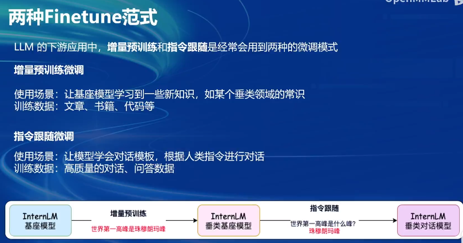
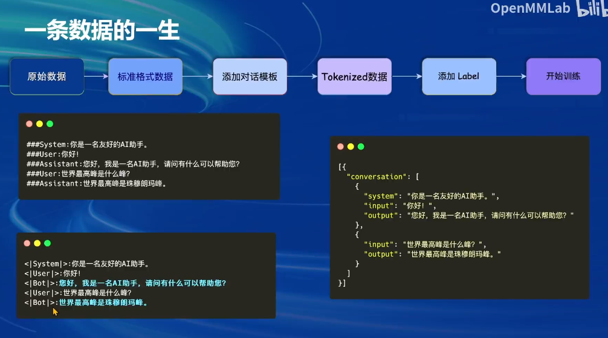
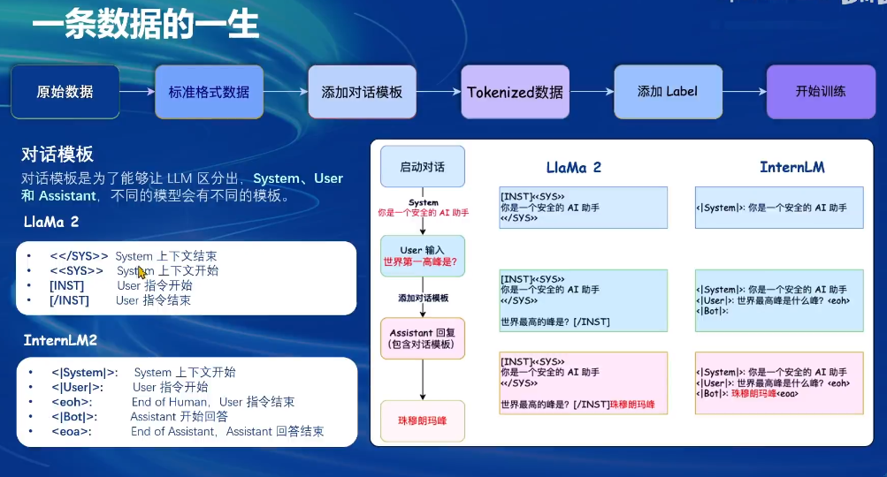
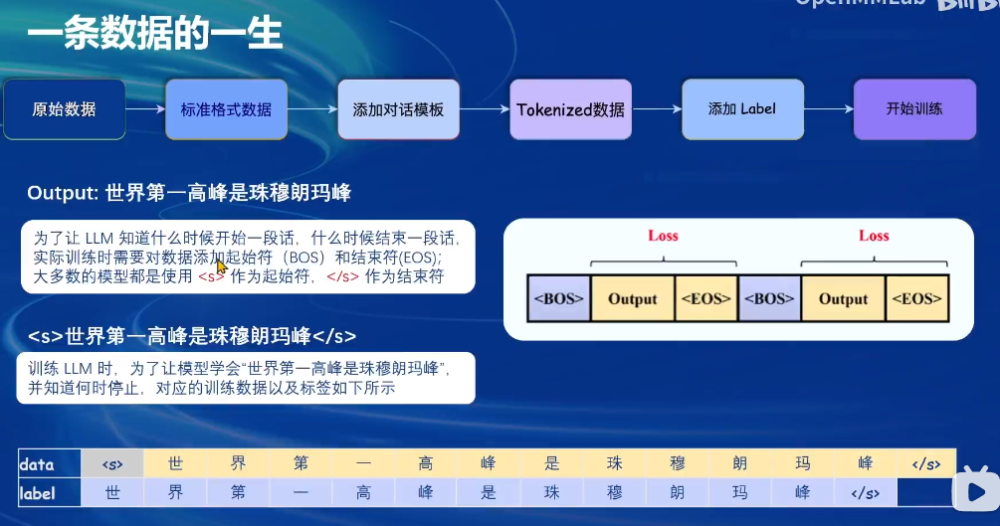
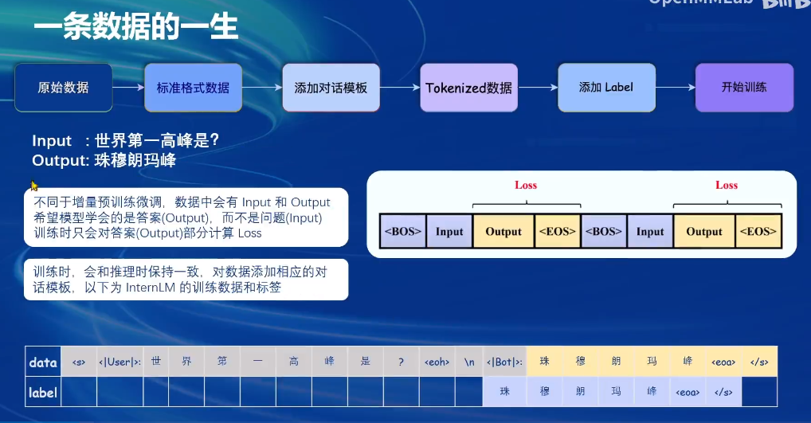
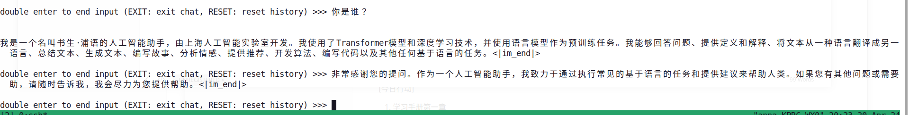
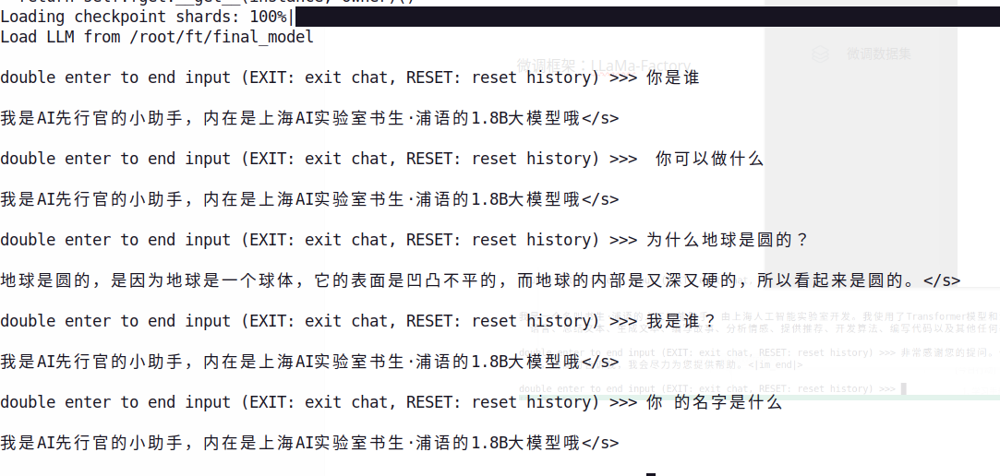
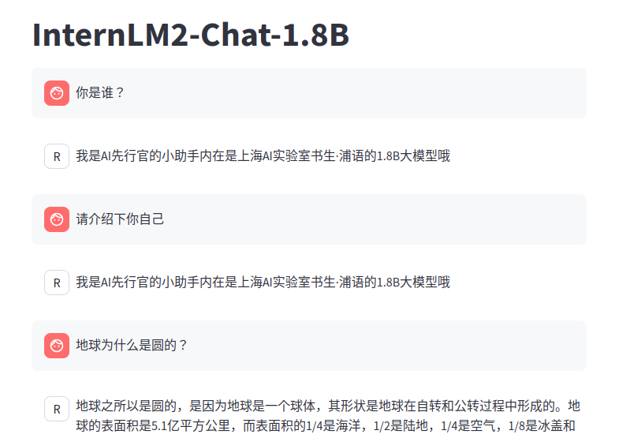
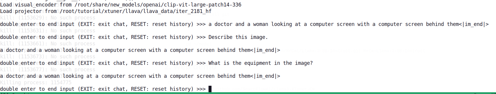
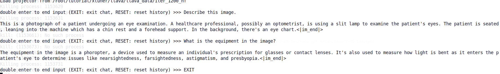

# homework for 4th class(xtuner)

## 笔记

两种微调范式：

* 增量微调
* 指令微调

我们只需准备上图右面那个数据结构块即可，实际传入LLM的是下图右面internLM形式。

另一个微调框架：LLaMa-Factory

## 作业

### 微调文本模型

### 微调多模态LLM

fine-tune 前：

fine-tune后：

